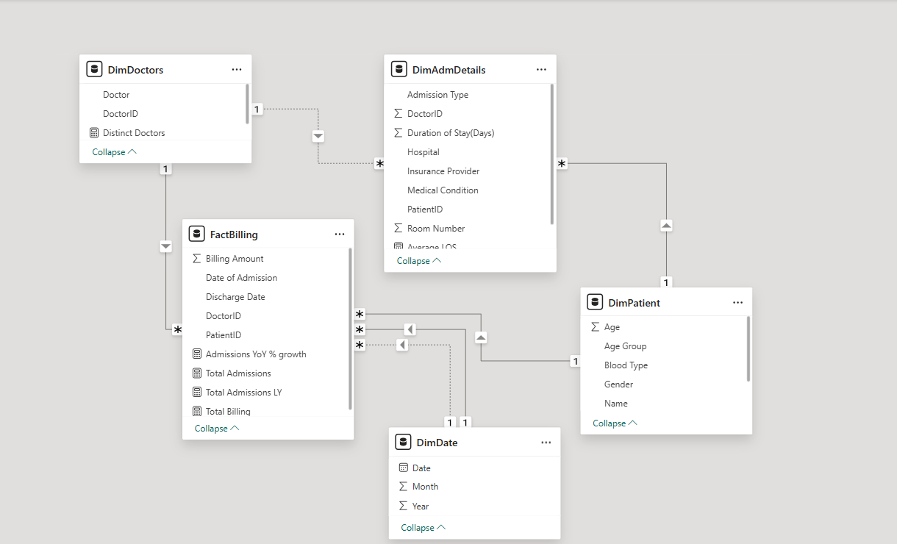
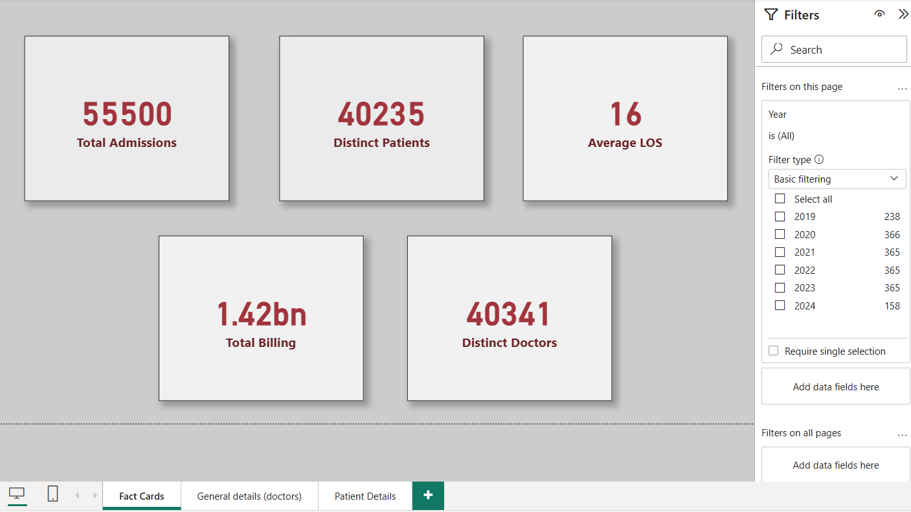
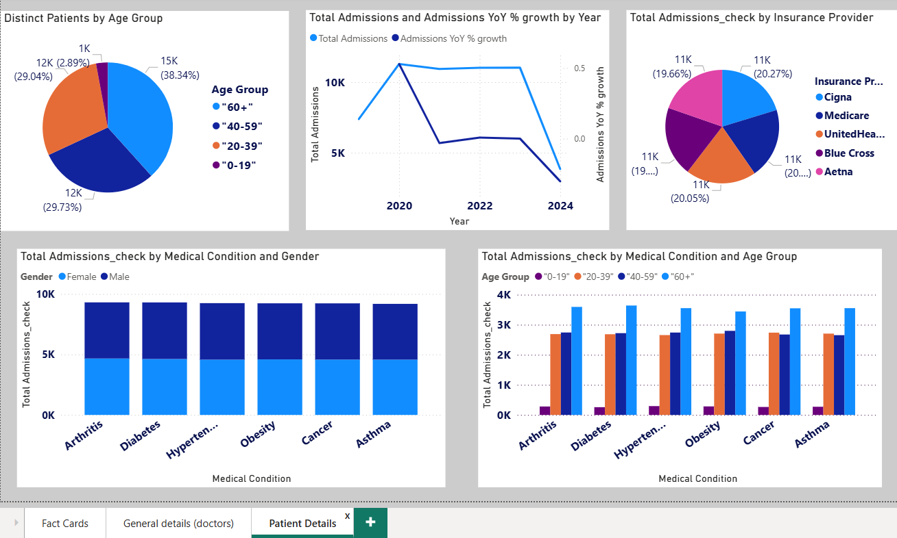
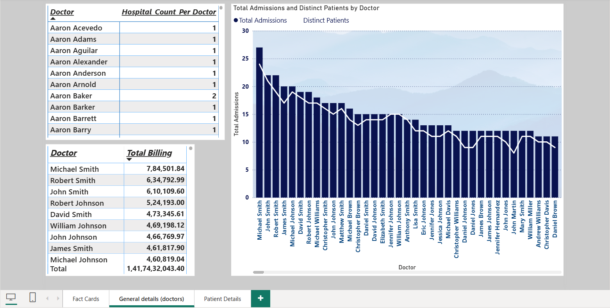

# 🏥 Healthcare Analytics Dashboard (Power BI)

This project showcases a **Healthcare Analytics Dashboard** built in **Power BI**, using a publicly available dataset from Kaggle.  
The goal is to analyze **hospital admissions, patient demographics, billing patterns, and doctor performance** to gain actionable insights for healthcare management.

---
## Preview Images

---

## 📂 Project Structure

- healthcare_dataset.csv # Dataset (from Kaggle)
- Healthcare_Analytics_Report.pdf # Report with screenshots + DAX formulas + insights
- README.md # Documentation (this file)

---

## 📊 Dashboard Features

### 1. Admissions Analysis
- Total admissions over time (yearly trends)  
- Year-over-Year (YoY) growth in admissions  
- Admissions and unique patients per doctor  

### 2. Patient Demographics
- Distribution by **age groups** (0–18, 19–35, 36–60, 60+)  
- Gender and blood-type breakdown  
- Admissions by hospital  

### 3. Billing Insights
- Total billing amount and revenue trends  
- Billing by doctor and hospital  
- Average billing per patient  

### 4. Doctor Performance
- Admissions handled per doctor  
- Billing contribution by doctor  
- Affiliation by hospital  
